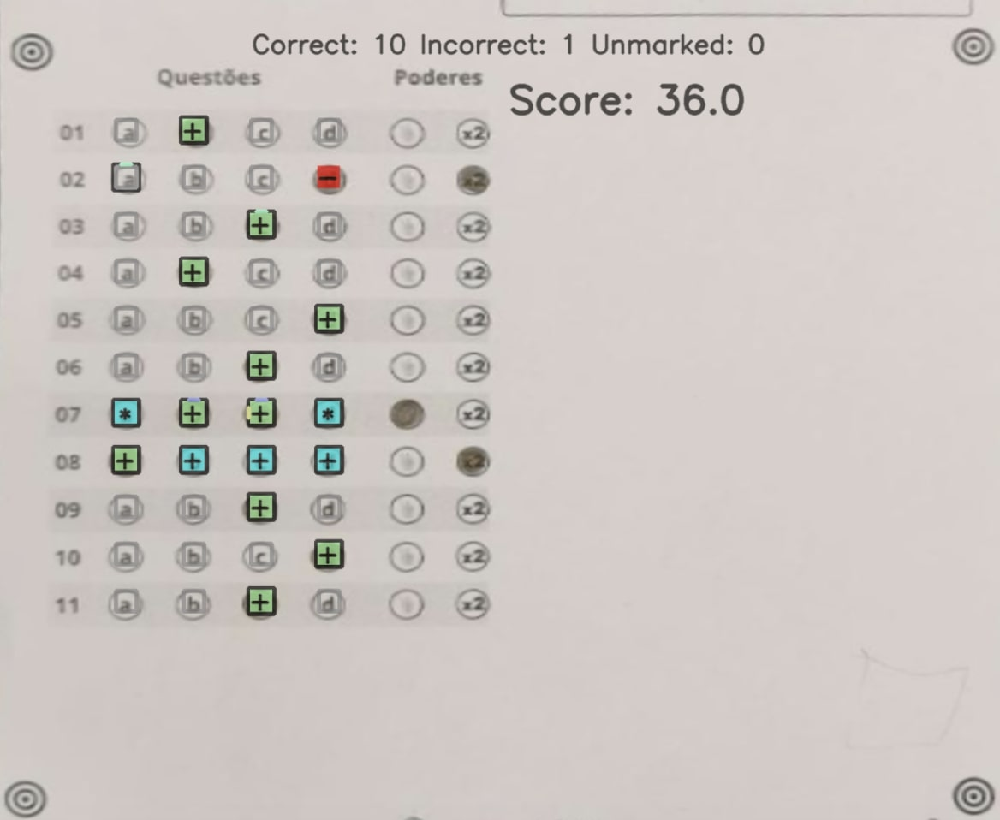

# OMR Checker

Evaluate OMR sheets fast and accurately using a scanner 🖨 or your phone 🤳.

## What is OMR?

OMR stands for Optical Mark Recognition, used to detect and interpret human-marked data on documents. OMR refers to the process of reading and evaluating OMR sheets, commonly used in exams, surveys, and other forms. The OMR sheet scanning is typically done using a scanner, but with OMRChecker it's supported for images from a mobile camera as well.

#### **Quick Links**

- [Installation](#getting-started)
- [User Guide](https://github.com/Udayraj123/OMRChecker/wiki)
- [Discord Community](https://discord.gg/qFv2Vqf)
- [Contributor Guide](https://github.com/Udayraj123/OMRChecker/blob/master/CONTRIBUTING.md)
- [Project Ideas List](https://github.com/users/Udayraj123/projects/2/views/1)

<hr />

[](https://github.com/Udayraj123/OMRChecker/pull/new/master) <!-- [](https://github.com/Udayraj123/OMRChecker/wiki/TODOs) -->
[](https://github.com/Udayraj123/OMRChecker/pulls?q=is%3Aclosed)
[](https://GitHub.com/Udayraj123/OMRChecker/issues?q=is%3Aissue+is%3Aclosed)

<!-- [](https://GitHub.com/Udayraj123/OMRChecker/graphs/contributors/) -->

[](https://GitHub.com/Udayraj123/OMRChecker/stargazers/)
[](https://discord.gg/qFv2Vqf)

<!-- [](https://colab.research.google.com/gist/Udayraj123/a125b1531c61cceed5f06994329cba66/omrchecker-on-cloud.ipynb) -->

## 🎯 Features

A full-fledged OMR checking software that can read and evaluate OMR sheets scanned at any angle and having any color.

| Specs  |    |
| :--------------------- | :--------------------------------------------------------------------------------------------------------------------------------------------------------------------------------------------------------------- |
| 💯 **Accurate**        | Currently nearly 100% accurate on good quality document scans; and about 90% accurate on mobile images.                                                                                                          |
| 💪🏿 **Robust**          | Supports low resolution, xeroxed sheets as well as colored images. See [**Robustness**](https://github.com/Udayraj123/OMRChecker/wiki/Robustness) for more.                                                      |
| ⏩ **Fast**            | Current processing speed without any optimization is 200 OMRs/minute.                                                                                                                                            |
| ✅ **Customizable**    | [Easily apply](https://github.com/Udayraj123/OMRChecker/wiki/User-Guide) to custom OMR layouts, surveys, etc.                                                                                                    |
| ✅ **Colorful**        | Supports Colored Outputs Since April 2024                                                                                                                                                                        |
| 📊 **Visually Rich**   | [Get insights](https://github.com/Udayraj123/OMRChecker/wiki/Rich-Visuals) to configure and debug easily.                                                                                                        |
| 🎈 **Lightweight**     | Very minimal core code size.                                                                                                                                                                                     |
| 🏫 **Large Scale**     | Tested on a large scale at [Technothlon](https://en.wikipedia.org/wiki/Technothlon).                                                                                                                             |
| 👩🏿‍💻 **Dev Friendly**    | Standard pyproject setup including uv, ruff, pre-commit, devcontainer, pytest, etc.                                                                                                                              |

Note: For solving interesting challenges, developers can check out [**TODOs**](https://github.com/Udayraj123/OMRChecker/wiki/TODOs).

See the complete guide and details at [Project Wiki](https://github.com/Udayraj123/OMRChecker/wiki/).

<!-- 💁🏿‍♂️ **User Friendly** - WIP, Help by contributing! -->

## 💡 What can OMRChecker do for me?

Once you configure the OMR layout, just throw images of the sheets at the software; and you'll get back the marked responses in an excel sheet!

Images can be taken from various angles as shown below-

<p align="center">
	
</p>

### Code in action on images taken by scanner:

<p align="center">
	

</p>

### Code in action on images taken by a mobile phone:

<p align="center">
	
</p>

## Visuals

### Processing steps

See step-by-step processing of any OMR sheet:

<p align="center">
	<a href="https://github.com/Udayraj123/OMRChecker/wiki/Rich-Visuals">
		
	</a>
	<br>
	*Note: This image is generated by the code itself!*
</p>

### Output

Get a CSV sheet containing the detected responses and evaluated scores:

<p align="center">
	<a href="https://github.com/Udayraj123/OMRChecker/wiki/Rich-Visuals">
		
	</a>
</p>

We now support [colored outputs](https://github.com/Udayraj123/OMRChecker/wiki/%5Bv2%5D-About-Evaluation) as well. Here's a sample output on another image -

<p align="center">
	<a href="https://github.com/Udayraj123/OMRChecker/wiki/%5Bv2%5D-About-Evaluation">
		
	</a>
</p>

#### There are many more visuals in the wiki. Check them out [here!](https://github.com/Udayraj123/OMRChecker/wiki/Rich-Visuals)

## Getting started


**Operating system:** OSX or Linux is recommended although Windows is also supported.

### 1. Install uv


To check if [uv](https://docs.astral.sh/uv) and its python environment is ready:

```bash
uv --version
uv run python3 --version
```

```
uv 0.7.8 (0ddcc1905 2025-05-23)
Python 3.11.11
```

<details>

<summary><b>Extra steps(for Linux users only)</b></summary>

<b>Installing missing libraries(if any):</b>

On a fresh computer, some of the libraries may get missing in event after a successful pip install. Install them using following commands[(ref)](https://www.pyimagesearch.com/2018/05/28/ubuntu-18-04-how-to-install-opencv/):

```bash
sudo apt-get install -y build-essential cmake unzip pkg-config
sudo apt-get install -y libjpeg-dev libpng-dev libtiff-dev
sudo apt-get install -y libavcodec-dev libavformat-dev libswscale-dev libv4l-dev
sudo apt-get install -y libatlas-base-dev gfortran
```

</details>

### 2. Install project dependencies

Clone the repo

```bash
git clone https://github.com/Udayraj123/OMRChecker
cd OMRChecker/
```

Install dependencies

```bash
uv sync
```

### 3. Run the code

1. First copy and examine the sample data to know how to structure your inputs:
   ```bash
   cp -r ./samples/sample1 inputs/
   # Note: you may remove previous inputs (if any) with `mv inputs/* ~/.trash`
   # Change the number N in sampleN to see more examples
   ```
2. Run OMRChecker:
   ```bash
   uv run main.py
   ```
   _Note: first time setup may take a while._
   This command will make sure the uv virtual environment is activated.

   Alternatively you can manually run -
   ```bash
   source ./.venv/bin/activate
   python3 main.py -i <path/to/dir>
   ```
   Each example in the samples folder demonstrates different ways in which OMRChecker can be used.

## OMRChecker for custom OMR Sheets

1. First, [create your own template.json](https://github.com/Udayraj123/OMRChecker/wiki/User-Guide).
2. Configure the tuning parameters. Also use `show_image_level` value to see debug images. Create a `config.json` in the same folder as your input images -
```json
{
   "outputs": {
      "show_image_level": 4
   }
}
```

3. Run OMRChecker with appropriate arguments (See full usage).
<!-- 4. Add answer key( TODO: add answer key/marking scheme guide)  -->

## Full Usage

```
uv run main.py [--setLayout] [--inputDir dir1] [--outputDir dir1]
```

Explanation for the arguments:

`--setLayout`: Set up OMR template layout - modify your json file and run again until the template is set.

`--inputDir`: Specify an input directory.

`--outputDir`: Specify an output directory.

<details>
<summary>
 <b>Deprecation logs</b>
</summary>

- The old `--noCropping` flag has been replaced with the 'CropPage' plugin in "preProcessors" of the template.json(see [samples](https://github.com/Udayraj123/OMRChecker/tree/master/samples)).
- The `--autoAlign` flag is deprecated due to low performance on a generic OMR sheet
- The `--template` flag is deprecated and instead it's recommended to keep the template file at the parent folder containing folders of different images
</details>

<!-- #### Testing the code
Datasets to test on :
Low Quality Dataset(For CV Based methods)) (1.5 GB)
Standard Quality Dataset(For ML Based methods) (3 GB)
High Quality Dataset(For custom processing) (6 GB)
-->

## FAQ

<details>
<summary>
<b>Why is this software free?</b>
</summary>

This project was born out of a student-led organization called as [Technothlon](https://technothlon.techniche.org.in). It is a logic-based international school championship organized by students of IIT Guwahati. Being a non-profit organization, and after seeing it work fabulously at such a large scale we decided to share this tool with the world. The OMR checking processes still involves so much tediousness which we aim to reduce dramatically.

We believe in the power of open source! Currently, OMRChecker is in an intermediate stage where only developers can use it. We hope to see it become more user-friendly as well as robust from exposure to different inputs from you all!

[](https://github.com/ellerbrock/open-source-badges/)

</details>

<details>
<summary>
<b>Can I use this code in my work?</b>
</summary>

OMRChecker can be forked and modified. You are encouraged to play with it and we would love to see your own projects in action!

It is published under the [MIT license](https://github.com/Udayraj123/OMRChecker/blob/master/LICENSE).

</details>

<details>
<summary>
<b>What are the ways to contribute?</b>
</summary>

- Join the developer community on [Discord](https://discord.gg/qFv2Vqf) to fix [issues](https://github.com/Udayraj123/OMRChecker/issues) with OMRChecker.

- If this project saved you some costs on OMR Software licenses, or saved efforts to make one. Consider donating an amount of your choice(donate section).

<!--  -->
<!-- [](https://www.paypal.com/cgi-bin/webscr?cmd=_s-xclick&hosted_button_id=Z5BNNK7AVFVH8&source=url) -->
<!-- https://www.amazon.in/hz/wishlist/ls/3V0TDQBI3T8IL -->

</details>

## Credits

_A Huge thanks to:_
_**Adrian Rosebrock** for his exemplary blog:_ https://pyimagesearch.com

_**Harrison Kinsley** aka sentdex for his [video tutorials](https://www.youtube.com/watch?v=Z78zbnLlPUA&list=PLQVvvaa0QuDdttJXlLtAJxJetJcqmqlQq) and many other resources._

_**Satya Mallic** for his resourceful blog:_ https://www.learnopencv.com

_And to other amazing people from all over the globe who've made significant improvements in this project._

_Thank you!_

## Related Projects

Here's a snapshot of the [Android OMR Helper App (archived)](https://github.com/Udayraj123/AndroidOMRHelper):

<p align="center">
	<a href="https://github.com/Udayraj123/AndroidOMRHelper">
		
	</a>
</p>

## Stargazers over time

[](https://starchart.cc/Udayraj123/OMRChecker)

---

<h2 align="center">Made with ❤️ by Awesome Contributors</h2>

<a href="https://github.com/Udayraj123/OMRChecker/graphs/contributors">
  
</a>

<p align="center">

[](https://GitHub.com/Udayraj123/OMRChecker/graphs/contributors/)

</p>

---

### License

[](https://github.com/Udayraj123/OMRChecker/blob/master/LICENSE)

For more details see [LICENSE](https://github.com/Udayraj123/OMRChecker/blob/master/LICENSE).

### Donate

<a href="https://www.buymeacoffee.com/Udayraj123" target="_blank"></a> [](https://www.paypal.me/Udayraj123/500)

_Find OMRChecker on_ [**_Product Hunt_**](https://www.producthunt.com/posts/omr-checker/) **|** [**_Reddit_**](https://www.reddit.com/r/computervision/comments/ccbj6f/omrchecker_grade_exams_using_python_and_opencv/) **|** [**Discord**](https://discord.gg/qFv2Vqf) **|** [**Linkedin**](https://www.linkedin.com/pulse/open-source-talks-udayraj-udayraj-deshmukh/) **|** [**goodfirstissue.dev**](https://goodfirstissue.dev/language/python) **|** [**codepeak.tech**](https://www.codepeak.tech/) **|** [**fossoverflow.dev**](https://fossoverflow.dev/projects) **|** [**Interview on Console by CodeSee**](https://console.substack.com/p/console-140) **|** [**Open Source Hub**](https://opensourcehub.io/udayraj123/omrchecker)

 <!-- [***Hacker News***](https://news.ycombinator.com/item?id=20420602) **|** -->
 <!-- **|** [***Swyya***](https://www.swyya.com/projects/omrchecker) -->
