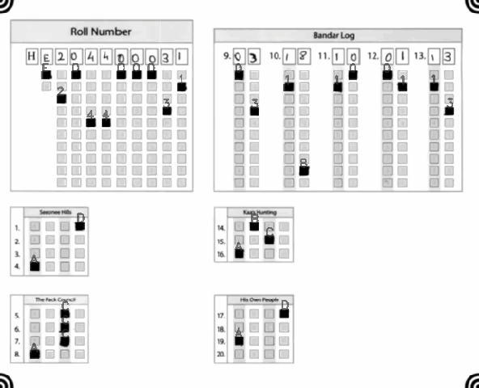

# OMR-Checker
A full-fledged OMR checking software that can read and evaluate OMR sheets scanned at any angle and having any color. With support for a customizable marking scheme with section-wise marking, bonus questions, etc. 

## How to run
Preferred operating system : *Linux*

#### 1. Clone the repo
Use `--depth=1` if you want only the latest version(less than half download size)
```
git clone --depth=1 https://github.com/udayraj123/OMRChecker
```

#### 2. Install dependencies

###### Install opencv
More details here: https://www.pyimagesearch.com/2018/09/19/pip-install-opencv/ 
```
sudo python3 -m pip install --upgrade pip
sudo python3 -m pip install opencv-python
sudo python3 -m pip install opencv-contrib-python
```

###### Install other requirements
```
sudo python3 -m pip install -r requirements.txt
```
If you face an distutils error, use the `--ignore-installed` flag 
```
sudo python3 -m pip install --ignore-installed -r requirements.txt
```

#### 3. Run the code

1. Make a copy of 'OMR_Files_sample' and rename it to 'OMR_Files' (Do not make changes to the directory structure)
2. Run code
	```
	python3 main.py
	```
3. :smirk: :smirk: :smirk:
4. Profit!!

### Folder Structure 


This structure has been created to suit for better organization of OMRs (Citywise, then Group-wise and Language-wise). Making changes to this would require changes in the code.

### Configuring for your OMR Sheets (W.I.P.)
	1. Put your OMR images in `inputs/OMR_Files/CityName/HE` (You can rename CityName)
	2. Put marker crop at `inputs/omr_marker.jpg`
	3. Put template layout(s) in `inputs/Layouts` (Guide coming soon)
	4. Adjust templ_scale_fac in globals.py
	5. (optional) More advanced configuration can be done in globals.py
	6. Run code - If your images are taken close-up using scanner, remember to run code with `--closeUp` option.


<!-- #### Testing the code
Datasets to test on : 
Low Quality Dataset(For CV Based methods)) (1.5 GB)
Standard Quality Dataset(For ML Based methods) (3 GB)
High Quality Dataset(For custom processing) (6 GB) 
-->

#### Note: Gitignore Content
```
**/ignore
**/gitignore
**/CheckedOMRs
**/OMR_Files
outputs/Results
**/__pycache__
```
<!-- 
## Code in action (To be updated)
#### Normal scans

<br>
#### Xerox scans

 -->