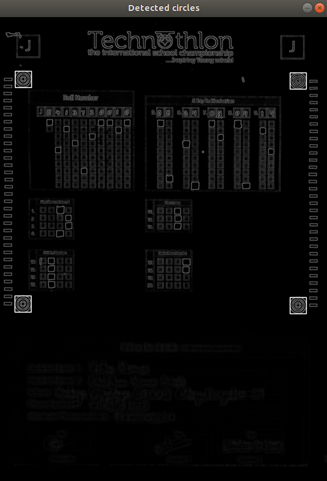
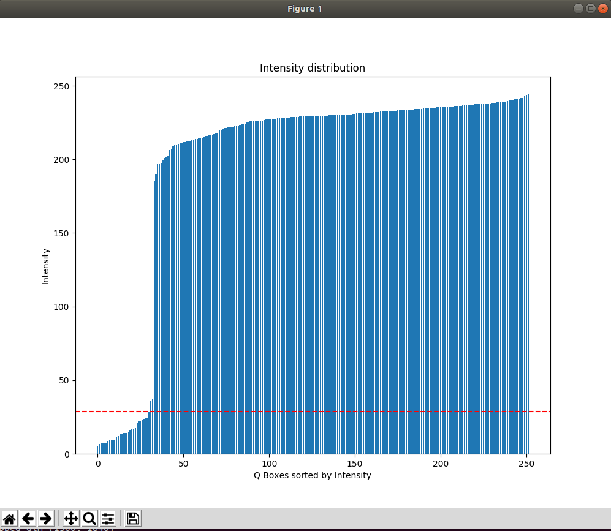

# OMR-Scanner
A full-fledged OMR checking software that can read and evaluate OMR sheets scanned at any angle and having any color. With support for a customizable marking scheme with section-wise marking, bonus questions, etc. 

## How to run
#### Install dependencies

Install opencv
More details here: https://www.pyimagesearch.com/2018/09/19/pip-install-opencv/ 
```
sudo python3 -m pip install opencv-python
```

```
sudo apt-get install python-tk
sudo python3 -m pip install --upgrade pip
sudo python3 -m pip install -r requirements.txt
```

## Code in action
#### Normal scans

<br>

#### Xerox scans


# How it works
1. All scanned OMR images are loaded, (or) taken one by one.
2. The scanned image is preprocessed


3. Four corner circles are detected



4. Image is then cropped and transformed using those four points and the distribution of intensity values at the question bubbles is used to identify a threshold.



5. Marked bubbles are detected and forwarded to the evaluator.


This work is actively in progress and many improvements are being done.

## TODOs
[X] Normalize the brightness: Run on 10-15 scans of empty OMRs for threshold tuning

> Can you plot the histogram on single image? _/_/

[X] For multi marks: Write algo to check threshold locally - variance values

> Can you plot the threshold distribution? _/_/

[ ] For shifted templ: Find out methods to force align on rectangular strips
	> Will need edge detection here?!

> Prob- some given scans also have negligible bg strips

## Curr Tasks

(28-30Aug 2018)
### 1) Run the outputs into omr detector.
	1.1 [X] Rescale Thresholds into 0-255 range
	1.2 [X] Show intensity vals at the boxes.
	1.3 [X] Readjust threshold values
	1.4 [X] Show b4_after comparision

(11-12 Sept 2018)
### 2) Redesign the template making code.
	2.1 [X] Make Q and Pt class, Modify template (and other) code to support the class
	2.2 [X] Rethink and implement grid gen functions
	2.3 [X] Fit the template for ints
	2.4 [X] JSONify the template
	2.5 [X] Fit the template for mcq and rolls

(12 Sept 2018)
### 3) Plot for each question
	3.1 [X] Change readResponse to adapt to Q class
	3.2 [X] Make hist subplots
	3.3 [X] Make boxplot subplots _/_/
	3.4 [X] Record/Report the progress


(11 Oct 2018)
### 4) Implement local variance
	4.1 [X] Sorted histplots
	4.2 [X] Local thresholding by finding 'the jump'

(11 Oct 2018)
### 5) Check for more improvements
	5.1 [..] Maybe **check this later** on getting mobile images.  CLAHE(Contrast Limited Adaptive Histogram Equalization) looks better than Normalization [2015](https://www.researchgate.net/publication/280776405_CheckIt_-_A_low_cost_mobile_OMR_system)
	5.2 [X] Normalize only at Q-level? -Nope, there may not be any white there(think multi marked)
	5.3 [ ] Explore uses of lowpass, highpass filters - maybe required for mobile images
		[..] --> Include actual mobile images in testbench now
	5.4 [X] Change mean to gaussian in boxreading for finer results - Nope, slight shifted templates will have prob!

### 6) Testbench generation
	
	(13-15 Oct 2018)
	6.1 [X] Learn about and use unittesting, refresh about geometric transformations [ref](https://docs.opencv.org/3.0-beta/doc/py_tutorials/py_imgproc/py_geometric_transformations/py_geometric_transformations.html)
	6.2 [X] Translation with partial clipping
	6.3 [X] Rotation without clipping
	6.4 [X] Warp 3D perspective - By Reversing the perspective: get Points by rotating outwards the lines of bounding rectangle
	6.5 [X] Add background to modified image (getting boundary outer black mask would've been easier, but you chose to store points!)

	()
	6.6 [ ] Images with more than 4 circles (like one OMR over another)
	6.7 [ ] Brightness and contrast variations


### 7) Refactor readResponse completely
	7.1 [ ] Simplify resp array generation
	7.2 [ ] Simplify detection process
	7.3 [ ] Minimize logging 

### 8) Make use of rectangular strips
	8.1 Think how would it be beneficial
	8.2 Find what methods are used to do this
	8.3 Think of adding it in code 

## Design Choices
	
### Function Means chart

#### Dev side
(Note: info old below. to be updated after decisions)

| Function         | Means             |             |                   |   			|
|------------------|-------------------|-------------|-------------------|--------------|
| Image Color  	   | [Grayscale]	   | RGB 	     | BGR 				 |   			|
| Choosing ROI     | 4 Opaque squares  | [4 circles] | Sidebars          |   Contours	|
| Setting Template | Individual Points | Q-wise      | [QRectangle-wise] |   			|
| Resolution       | [High scaledown]  | scaledown 	 | Original      	 |  Scaled Up   |
| Thresholding     | [per-Img marginal]| Tone-based* | Fixed             | 	 			|

* to be achieved

#### User side
Starts once the dev side is complete
