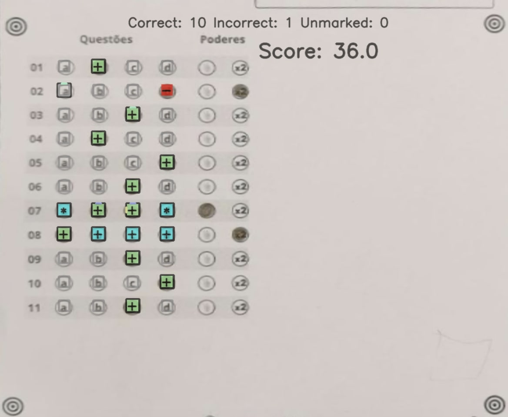

# OMR Checker

Evaluate OMR sheets fast and accurately using a scanner 🖨 or your phone 🤳.

---

## What is OMR?

OMR stands for Optical Mark Recognition, used to detect and interpret human-marked data on documents. OMR refers to the process of reading and evaluating OMR sheets, commonly used in exams, surveys, and other forms. The OMR sheet scanning is typically done using a scanner, but with OMRChecker it's supported for images from a mobile camera as well.


[](https://github.com/Udayraj123/OMRChecker/pull/new/master)
[](https://GitHub.com/Udayraj123/OMRChecker/stargazers/)
[](https://discord.gg/qFv2Vqf)

## 🎯 Key Features

 

- 💯 **Accurate**: ~100% on scanned documents, ~90% on mobile images
- 💪🏿 **Robust**: Works with low resolution, xeroxed, and colored sheets scanned at any angle
- ⏩ **Fast**: Has achieved 200+ OMRs per minute rate
- ✅ **Customizable**: Easy to adapt for custom layouts and surveys
- 📊 **Visual Debugging**: Rich visual outputs for configuration and troubleshooting
- 🎈 **Lightweight**: Classical image processing with OpenCV
- 👩🏿‍💻 **Dev Friendly**: Modern Python setup with uv, ruff, pytest, pre-commit

See the complete guide at [Project Wiki](https://github.com/Udayraj123/OMRChecker/wiki/).

## Quick Links
[Installation](#getting-started) | [User Guide](https://github.com/Udayraj123/OMRChecker/wiki) | [Discord Community](https://discord.gg/qFv2Vqf) | [Contributing](https://github.com/Udayraj123/OMRChecker/blob/master/CONTRIBUTING.md)

## 💡 How It Works

Once you configure the OMR layout, simply provide images of the sheets and get back the marked responses in a CSV file. The software works with images taken from scanners or mobile phones at various angles.

<p align="center">
	
</p>

### Code in action on images taken by scanner:

<p align="center">
	

</p>

### Code in action on images taken by a mobile phone:

<p align="center">
	
</p>

## Visuals

### Processing steps

See step-by-step processing of any OMR sheet:

<p align="center">
	<a href="https://github.com/Udayraj123/OMRChecker/wiki/Rich-Visuals">
		
	</a>
	<br>
	*Note: This image is generated by the code itself!*
</p>

### Output

Get a CSV sheet containing the detected responses and evaluated scores:

<p align="center">
	<a href="https://github.com/Udayraj123/OMRChecker/wiki/Rich-Visuals">
		
	</a>
</p>

We now support [colored outputs](https://github.com/Udayraj123/OMRChecker/wiki/%5Bv2%5D-About-Evaluation)  for better visualization:

<p align="center">
	<a href="https://github.com/Udayraj123/OMRChecker/wiki/%5Bv2%5D-About-Evaluation">
		
	</a>
</p>

## Getting Started


**Operating system:** OSX or Linux is recommended, though Windows is also supported.

### 1. Install uv


Check if [uv](https://docs.astral.sh/uv) is installed:

```bash
uv --version
uv run python3 --version
```

<details>
<summary><b>Extra steps (Linux users only)</b></summary>

Install missing libraries if needed:

```bash
sudo apt-get install -y build-essential cmake unzip pkg-config
sudo apt-get install -y libjpeg-dev libpng-dev libtiff-dev
sudo apt-get install -y libavcodec-dev libavformat-dev libswscale-dev libv4l-dev
sudo apt-get install -y libatlas-base-dev gfortran
```

</details>

### 2. Install Project Dependencies

```bash
git clone https://github.com/Udayraj123/OMRChecker
cd OMRChecker/
uv sync
```

### 3. Run the Code

```bash
# Copy sample data
cp -r ./samples/sample1 inputs/

# Run OMRChecker
uv run main.py
```

For custom input directories:

```bash
uv run main.py -i <path/to/dir>
```

## Custom OMR Sheets

1. [Create your template.json](https://github.com/Udayraj123/OMRChecker/wiki/User-Guide)
2. Configure tuning parameters in `config.json`:

```json
{
   "outputs": {
      "show_image_level": 4
   },
   "thresholding": {
      "GLOBAL_PAGE_THRESHOLD": 180
   }
}
```


3. Run with appropriate arguments (see usage below)

## Usage

```bash
uv run main.py [--setLayout] [--inputDir dir1] [--outputDir dir1]
```

**Arguments:**
- `--setLayout`: Set up OMR template layout
- `--inputDir`: Specify input directory
- `--outputDir`: Specify output directory

## FAQ

<details>
<summary><b>Why is this software free?</b></summary>

This project was born from [Technothlon](https://technothlon.techniche.org.in), a student-led organization at IIT Guwahati. As a non-profit, we wanted to share this tool with the world to dramatically reduce the tediousness of OMR checking.

We believe in the power of open source!

[](https://github.com/ellerbrock/open-source-badges/)

</details>

<details>
<summary><b>Can I use this in my work?</b></summary>

Yes! OMRChecker is published under the [MIT license](https://github.com/Udayraj123/OMRChecker/blob/master/LICENSE). You're encouraged to fork, modify, and use it in your projects.

</details>

<details>
<summary><b>How can I contribute?</b></summary>

- Join the developer community on [Discord](https://discord.gg/qFv2Vqf)
- Fix [issues](https://github.com/Udayraj123/OMRChecker/issues)
- Check out [TODOs](https://github.com/Udayraj123/OMRChecker/wiki/TODOs) for interesting challenges
- Consider [donating](#donate) if this saved you time or money

</details>

## Credits

Thanks to:
- **Adrian Rosebrock** for [pyimagesearch.com](https://pyimagesearch.com)
- **Harrison Kinsley** (sentdex) for [video tutorials](https://www.youtube.com/watch?v=Z78zbnLlPUA&list=PLQVvvaa0QuDdttJXlLtAJxJetJcqmqlQq)
- **Satya Mallic** for [learnopencv.com](https://www.learnopencv.com)
- All the amazing contributors from around the globe!

---

<h2 align="center">Made with ❤️ by Awesome Contributors</h2>

<a href="https://github.com/Udayraj123/OMRChecker/graphs/contributors">
  
</a>

<p align="center">

[](https://GitHub.com/Udayraj123/OMRChecker/graphs/contributors/)
[](https://starchart.cc/Udayraj123/OMRChecker)

</p>

---

### License

[](https://github.com/Udayraj123/OMRChecker/blob/master/LICENSE)

For details see [LICENSE](https://github.com/Udayraj123/OMRChecker/blob/master/LICENSE).

### Donate

<a href="https://www.buymeacoffee.com/Udayraj123" target="_blank"></a> [](https://www.paypal.me/Udayraj123/500)

_Find OMRChecker on_ [**Product Hunt**](https://www.producthunt.com/posts/omr-checker/) **|** [**Reddit**](https://www.reddit.com/r/computervision/comments/ccbj6f/omrchecker_grade_exams_using_python_and_opencv/) **|** [**Discord**](https://discord.gg/qFv2Vqf) **|** [**Linkedin**](https://www.linkedin.com/pulse/open-source-talks-udayraj-udayraj-deshmukh/) **|** [**Interview on Console**](https://console.substack.com/p/console-140)
