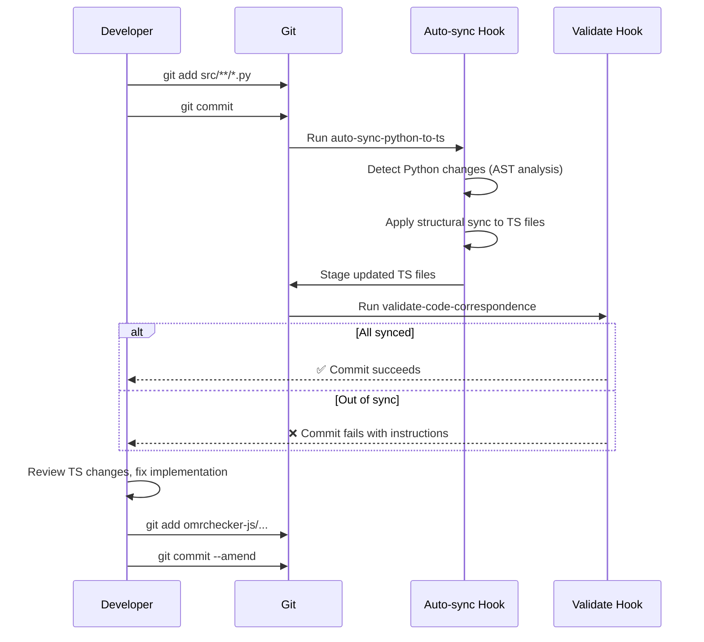

# Auto-Sync Python → TypeScript Workflow

This document describes the new hook-based automatic synchronization system that replaces the previous web-based change-propagation-tool.

## Overview

The auto-sync system automatically migrates structural changes (classes and methods) from Python to TypeScript as part of the pre-commit hook workflow. This eliminates manual tracking and ensures TypeScript files stay in sync with Python changes.

## How It Works



## What Gets Auto-Synced

### ✅ Automatic (Hook handles these)

- **Added classes**: Creates class stub with TODO comment
- **Deleted classes**: Comments out the class
- **Added methods**: Creates method stub with camelCase name
- **Deleted methods**: Comments out the method
- **Method name mapping**: Uses `FILE_MAPPING.json` for Python↔TypeScript name mapping

### ❌ Manual (You must handle these)

- Method implementations and logic
- Type annotations and parameter types
- Return type specifications
- Import statements
- Constants and class properties
- Complex refactorings
- Business logic and algorithms

## Usage

### 1. Normal Git Workflow (Automatic)

```bash
# 1. Make changes to Python files
vim src/processors/image/CropPage.py

# 2. Stage your changes
git add src/processors/image/CropPage.py

# 3. Commit (auto-sync runs automatically)
git commit -m "Add new preprocessing method"

# 4. Review the auto-synced TypeScript file
vim omrchecker-js/packages/core/src/processors/image/CropPage.ts

# 5. Fix implementation details, types, and logic
# (auto-sync only creates stubs, you must implement)

# 6. Run tests
cd omrchecker-js && pnpm test

# 7. Stage additional fixes
git add omrchecker-js/packages/core/src/processors/image/CropPage.ts

# 8. Amend or create new commit
git commit --amend --no-edit
# or
git commit -m "Implement TypeScript version of preprocessing method"
```

### 2. Manual Sync (Without Committing)

```bash
# Run auto-sync on currently staged files
uv run python scripts/sync_tool.py auto-sync

# Check overall sync status
uv run python scripts/sync_tool.py status -v

# Detect what needs syncing
uv run python scripts/sync_tool.py detect

# Generate TypeScript suggestions for a specific file
uv run python scripts/sync_tool.py suggest src/processors/image/CropPage.py
```

## Pre-Commit Hook Configuration

The `.pre-commit-config.yaml` now includes two hooks in sequence:

1. **auto-sync-python-to-ts**: Runs first, applies structural changes, stages TS files
2. **validate-code-correspondence**: Runs second, ensures everything is synced

```yaml
- repo: local
  hooks:
    - id: auto-sync-python-to-ts
      name: Auto-sync Python → TypeScript
      entry: ./scripts/run_python_hook.sh scripts/hooks/auto_sync_python_to_ts.py
      files: ^src/.*\.py$
      language: script
      pass_filenames: false
      fail_fast: false
      stages: [pre-commit]

    - id: validate-code-correspondence
      name: Validate Python ↔ TypeScript correspondence
      entry: ./scripts/run_python_hook.sh scripts/hooks/validate_code_correspondence.py
      files: ^src/.*\.py$
      language: script
      pass_filenames: false
      fail_fast: true
      stages: [pre-commit]
```

## New Scripts

### `scripts/sync_ts_from_python.py`

Core sync logic that:
- Parses TypeScript files (minimal parsing, no full AST)
- Finds class and method boundaries using regex
- Applies structural changes (add/remove/comment stubs)
- Uses `FILE_MAPPING.json` for name mapping
- Writes updated TypeScript files

**Usage:**
```bash
uv run python scripts/sync_ts_from_python.py \
  --repo-root . \
  --changes-json /tmp/changes.json \
  --stage
```

### `scripts/hooks/auto_sync_python_to_ts.py`

Pre-commit hook entry point that:
- Detects staged Python files
- Filters by `FILE_MAPPING.json` (excludes "future" phase)
- Calls `detect_python_changes.py` for AST analysis
- Calls `sync_ts_from_python.py` to apply changes
- Stages updated TypeScript files
- Provides rich terminal output

**Runs automatically on:** `git commit` (when Python files are staged)

## Example Output

```
🔄 Auto-syncing Python → TypeScript...

┌─────────────────────────────────────────────┐
│ Python File              │ TypeScript File  │
├──────────────────────────┼──────────────────┤
│ processors/image/base.py │ processors/ima…  │
│ processors/image/Crop…   │ processors/ima…  │
└─────────────────────────────────────────────┘

✅ Updated 2 TypeScript file(s):
   - omrchecker-js/packages/core/src/processors/image/base.ts
   - omrchecker-js/packages/core/src/processors/image/CropPage.ts

✅ Staged modified TypeScript files

┌─────────────────────────────────────────────┐
│ Auto-sync Complete                          │
├─────────────────────────────────────────────┤
│ ✅ TypeScript files auto-updated and staged!│
│                                             │
│ Next steps:                                 │
│   1. Review the TypeScript changes         │
│   2. Manually fix implementations & types   │
│   3. Run tests: cd omrchecker-js && pnpm…  │
│   4. Stage fixes: git add <files>          │
│   5. Retry commit                           │
└─────────────────────────────────────────────┘
```

## Troubleshooting

### Hook fails with "Module not found"

Make sure you have the required dependencies:
```bash
uv sync  # Install Python dependencies including rich
```

### TypeScript file not synced

Check if:
1. The file is in `FILE_MAPPING.json`
2. The phase is not "future" (future phase files are skipped)
3. The TypeScript path is valid (not "N/A" or "REMOVED")

### Want to bypass the hook temporarily

```bash
git commit --no-verify  # Not recommended
```

### Manual sync without committing

```bash
# Stage your Python changes first
git add src/**/*.py

# Then run auto-sync
uv run python scripts/sync_tool.py auto-sync
```

## Benefits

1. **Automatic**: No manual tracking of which TS files need updating
2. **Fast**: Structural sync happens in seconds as part of commit
3. **Consistent**: All developers use the same sync mechanism
4. **Visible**: Shows exactly what was synced in rich terminal output
5. **Reviewable**: Changes are staged, easy to review in git diff
6. **Recoverable**: Comments out deletions instead of removing code

## Limitations

- Only handles structural changes (classes/methods)
- Does not translate logic or implementations
- Basic TypeScript parsing (no full AST)
- Does not handle complex refactorings
- Manual implementation still required

## Migration from Old Change Tool

The previous web-based `change-propagation-tool` (Vite UI) has been removed. All references to `pnpm run change-tool` have been updated to point to the new hook-based workflow.

**Old workflow:**
```bash
git commit  # Failed
pnpm run change-tool  # Launch web UI
# Manually sync in browser
git add ...
git commit
```

**New workflow:**
```bash
git commit  # Auto-syncs + stages TS files
# Review auto-synced changes
# Fix implementations
git add ...
git commit --amend
```
