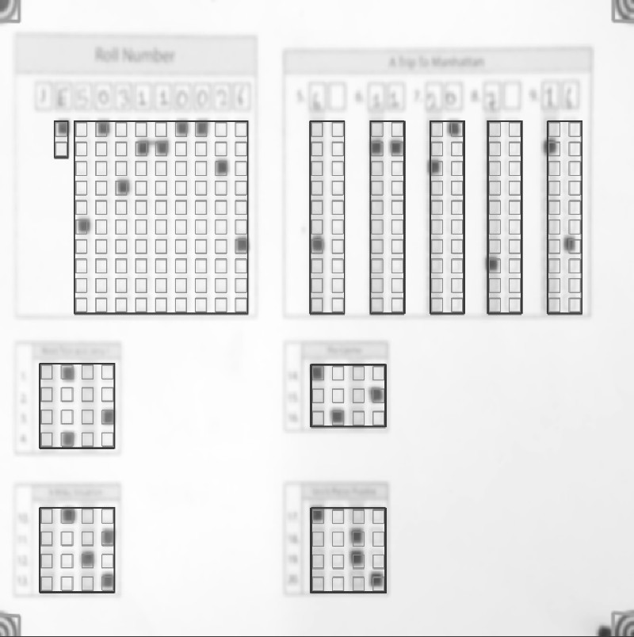

## Meaning of parameters used in the template.json file

Let's take an example of sample1 from the [samples](https://github.com/Udayraj123/OMRChecker/tree/master/samples). 

You may use below commands from project root to load the sample template.
```bash
python3 main.py -i samples/sample1 --setLayout
```
Which shows the template overlay like below -
<p align="center">
  
</p>


Let's examine the template.json used in this sample.
```js
{
  // The dimensions(width, height) to which the page will be resized to before applying template
  "pageDimensions": [
    1846,
    1500
  ],
  // The dimensions of the overlay bubble area
  "bubbleDimensions": [
    40,
    40
  ],
  // Custom configuration values to use in the template's directory
  "preProcessors": [
    {
      // Page boundary based cropping plugin
      "name": "CropPage",
      "options": {
        // size of the kernel to use for cropping (default for most cases)
        "morphKernel": [
          10,
          10
        ]
      }
    },
    {
      // Marker based cropping plugin
      "name": "CropOnMarkers",
      "options": {
        // path to marker file
        "relativePath": "omr_marker.jpg",
        // a factor by which marker shall be resized relative to input image 
        "sheetToMarkerWidthRatio": 17
      }
    }
  ],
  
// The customLabels contain fields that need to be joined together before generating the results sheet
  "customLabels": {
    // Here the "Roll" key corresponds to a single column in the results
    "Roll": [
      "Medium",
      "roll1",
      "roll2",
      "roll3",
      "roll4",
      "roll5",
      "roll6",
      "roll7",
      "roll8",
      "roll9"
    ],
    // customLabels can also be used for two-digit integer type questions.
    "q5": [
      "q5_1",
      "q5_2"
    ],
    // ...
  },
  // Each rectangular box you see in the template overlay image is an item in fieldBlocks 
  "fieldBlocks": {
    // ...

    // Create a block of MCQ type questions

    "MCQ_Block_Q1": {
      // Here, QTYPE_MCQ4 is a built-in field type with four values ["A", "B", "C", "D"]
      "fieldType": "QTYPE_MCQ4",
      // The ordered questions in this block (length of this array is the number of questions in this block)
      // A custom parser also recognises ["q1..4"] to implement the same list below
      "fieldLabels": ["q1", "q2", "q3", "q4"],
      // The gaps between the bubbles
      "bubblesGap": 59,
      // The gaps between the labels i.e. the mcq questions
      "labelsGap": 50,
      // The starting point of the block (top left)
      "origin": [121, 860]
    },
    
    // This shows how integer type questions are created.
    "Int_Block_Q5": {
      // Here, QTYPE_INT is a built-in field type with vertical arrangement of 0-9 integers
      "fieldType": "QTYPE_INT",
      // These field labels will concatenated together as declared in customLabels earlier.
      "fieldLabels": ["q5_1", "q5_2"],
      // The gaps between the bubbles
      "bubblesGap": 46,
      // The gaps between the labels i.e. the two integer columns
      "labelsGap": 60,
      // The starting point of the block (top left)
      "origin": [903, 282]
    },

    // A custom field
    "Medium": {
      // The starting point of the block (top left)
      "origin": [
        170,
        282
      ],
      // The direction of the bubbles
      "direction": "vertical",
      // The gaps between the bubbles
      "bubblesGap": 41,
      // Custom values for the bubbles (length of this array is the number of bubbles per field)
      "bubbleValues": ["E", "H"],
      // The labels for fields in the block 
      "fieldLabels": ["Medium"],
      // Since we have only one label in this block, we set labelsGap as 0
      "labelsGap": 0,
    },

    // ... rest of the fieldBlocks
  },
  // All the columns in order(custom and non-custom) to be outputted in the results sheet
  "outputColumns": [
    "Roll",
    "q1",
    "q2",
    // ...
  ],
  // The value to be used in case of empty bubble detected
  "emptyValue": ""
}
```

## More details

You can find the full template schema in the [source code](https://github.com/Udayraj123/OMRChecker/blob/master/src/schemas/template_schema.py).