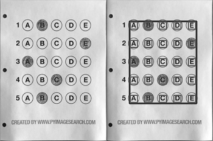

## All Detailed Visuals possible using this software:
<!-- PUT LOTS OF IMAGES HERE -->

### Inputs:
Sample Input

Inputs Scanner

Inputs Xeroxed

Inputs Mobile

Inputs Mobile Xxeroxed

## Gifs: 
### Code in Action:
Document Scanner 

Checking Inputs Mobile 

Checking Xeroxed Mobile 

Checking Xeroxed Scanned 

### Histograms
Colored Print:

Xeroxed OMR:

Histogram for Dark image: 

Histogram on High bubbling: 

Histogram on Images with Shadow: 

Various Histograms

### Boxplots
Boxplot for Dark image: 

### Intermediate Steps: 

#### Finding the page

#### Finding Markers

#### Template Layout Alignment

#### Finding Threshold
###### Global

###### Local

### All Output Steps (Stacks)

Bubbling:

Midfolding:

Perspective:

Rotation:

Shadow:

Temperament:

Sidefolding:

### The ultimate output
CSV File: 

### Template Layout Setting

### Android App Sneak Peek

